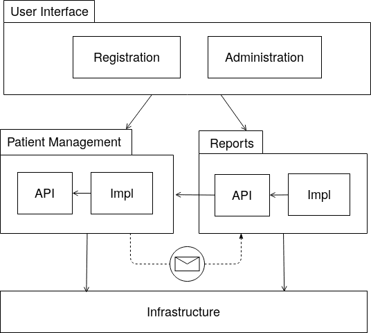

# K.S.C.H. Workflows

[](https://travis-ci.com/ksch-workflows/ksch-workflows) [](https://bestpractices.coreinfrastructure.org/projects/2328)

The [Kirpal Sagar Charitable Hospital](https://kirpal-sagar.org/en/kirpal-charitable-hospital-en/) is a small hospital in [Punjab, India](https://www.google.com/maps/place/Kirpal+Sagar+Hospital/@31.02067,76.0855824,16z/data=!4m8!1m2!2m1!1skirpal+sagar!3m4!1s0x0:0xc422150834d1e3a5!8m2!3d31.0187086!4d76.0890837) where all people receive treatment and then pay what they can afford. It is envisioned to grow up to 500 beds and become part of a Medical College. The purpose of this project is to support that vision.

## Domain language

| Term | Description |
|------|-------------|
| OPD | Outpatient department. |
| IPD | Inpatient department. |
| OPD number | Used as visit number which is assigned to each patient who enters the hospital, including IPD patients |

## Software architecture

In order to be aplicable in a low-resource environment we try to keep the system as simple as possible. Another important architectural goal is evolvability in terms of the business requirements. Further we need high quality in terms of robustness, test coverage, and technical documentation.

### Technology stack

The project is built upon the following technologies:

- [Java](https://github.com/ksch-workflows/ksch-workflows/wiki/Java) - the primarily used programming language
- [Spring Boot](https://github.com/ksch-workflows/ksch-workflows/wiki/Spring-Boot) - a framework for the development of enterprise applications
- [Apache Wicket](https://github.com/ksch-workflows/ksch-workflows/wiki/Apache-Wicket) - connects the HTML web pages with the business logic expressed in Java
- [Bootstrap](https://github.com/ksch-workflows/ksch-workflows/wiki/Bootstrap) - provides a comprehensive set of patterns for the layout of the HTML pages
- [Gradle](https://github.com/ksch-workflows/ksch-workflows/wiki/Gradle) - used for the compilation of the source code into an executable application  

### Repository structure

The project is split into modules with the help of [Gradle multi-project builds](https://docs.gradle.org/current/userguide/multi_project_builds.html). Each one of the domain modules consists of two sub-modules, one for the API and one for its implementation. The API defines interfaces for the domain's data objects and services which can be executed on it. The implementation specifies the business logic and persistence details with the help of Spring and other common open-source tools. The User Interface then uses the APIs specified by the various domain modules and composes the hospital workflows.

When a module declares a dependency on another module it can use its API via Spring's dependency injection functionality. However, the module dependencies cannot be bi-directional. If the modules need to interact nevertheless, they can do so by using events and the [publish-subscribe interaction model](https://en.wikipedia.org/wiki/Publish%E2%80%93subscribe_pattern) which is facilitated by [Spring Application Events](https://spring.io/blog/2015/02/11/better-application-events-in-spring-framework-4-2).



## Development

### Dependencies

The project uses the JDK 11. Here are some hints for the installation of the Java Development Kit:

- [Ubuntu](https://github.com/ksch-workflows/ksch-workflows/wiki/Installing-Java-on-Ubuntu)
- [Windows](https://github.com/ksch-workflows/ksch-workflows/wiki/Installing-Java-on-Windows)
- [MacOS](https://github.com/ksch-workflows/ksch-workflows/wiki/Installing-Java-on-MacOS)

For the development environment IntelliJ and Eclipse are supported.
Please refer to the following wiki pages for explanations for configuring those IDEs for this project:

- [IntelliJ](https://github.com/ksch-workflows/ksch-workflows/wiki/Import-Project-with-IntelliJ)
- [Eclipse](https://github.com/ksch-workflows/ksch-workflows/wiki/Import-Project-with-Eclipse)

### Starting the application

The application can be started for development tests with the following Gradle task:

```
./gradlew clean bootRun -Dspring.profiles.active=qa
```

Then it is accessible in the browser under the URL http://localhost:8080 (login: user / pwd).

The database can be inspected under this URL: http://localhost:8080/h2-console (login: sa / <empty password>).

### Run mutation tests

With the help of mutation tests it is possible to improve the quality of the unit
tests. It works like this that the mutation testing tool injects defects into the
source code and then executes the test suite. Afterwards it creates a report about
the defects which where caught by the unit tests and which where not. Those
instances where the injected defects where not caught are hints about parts of the
source code for which better unit tests should be created.

```
./gradlew clean pitest
```

Afterwards HTML reports are generated for each respective subproject and can be found in the directory `build/reports/pitest`:

```
find . -name "index.html" | grep "pitest"
```

## Maintenance

### SonarCube analysis

```
docker run -d --name sonarqube -p 9000:9000 sonarqube
gradle sonarqube -Dsonar.host.url=http://localhost:9000
```

### Check for updates of dependencies

```
./gradlew dependencyUpdates -Drevision=release
```

Get an overview over transitive dependencies:

```
./gradlew dependencyTree
```

## Deployment

The executable JAR file can be compiled with the following Gradle task:

```
./gradlew clean bootJar
```

Afterwards you can find the JAR file in the following directory:

```
$ ls user-interface/build/libs
ksch-workflows-0.1.0-SNAPSHOT.jar
```

The JAR file can then be copied onto the server and started like this:

```
java -jar ksch-workflows-0.1.0-SNAPSHOT.jar
```

### Build Docker image

```
docker build --tag expsoftware/ksch-workflows .
docker push expsoftware/ksch-workflows

docker run -p 80:8080 expsoftware/ksch-workflows
```

## Contact information

If you have any question or idea, please join this chat room and post it there:

https://gitter.im/ksch-workflows/Lobby

## License

K.S.C.H. Workflows is maintained by [KS-plus](https://ks-plus.org/en/welcome/),
an association dedicated to supporting the [Kirpal Sagar](https://kirpal-sagar.org/en/welcome/) project.

It is licensed under the [Apache License Version 2.0](https://github.com/ksch-workflows/ksch-workflows/blob/master/LICENSE).
